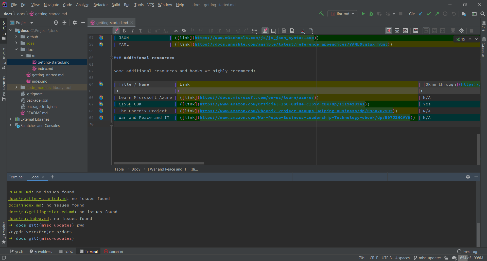

# cygwin-scripts

Script that helps install all previously installed packages e.g. when you're
reinstalling [`Cygwin`](https://www.cygwin.com/). This repository also contains
a pre-generated file `cyg-reinstall-x86_64.bat` to help with the first `Cygwin`
install.

Solution borrowed from:
[stackoverflow.com](https://stackoverflow.com/a/46830336)
([original link](https://stackoverflow.com/questions/46829532/cygwin-save-package-selections-for-later-reinstall))

Our thanks to its author,
[**matzeri**](https://stackoverflow.com/users/5105383/matzeri)!

## Cygwin shells with Intellij IDEA

You can use any shell you like with IDEA,
[click here to learn how](https://www.jetbrains.com/help/idea/settings-tools-terminal.html).
And `Cygwin` allows access to most popular shells at Windows.

Here's an example with `zsh`. It's already included in the reinstall script in
this repository.

